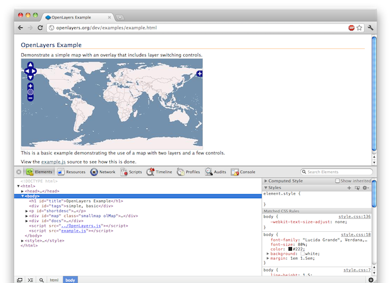
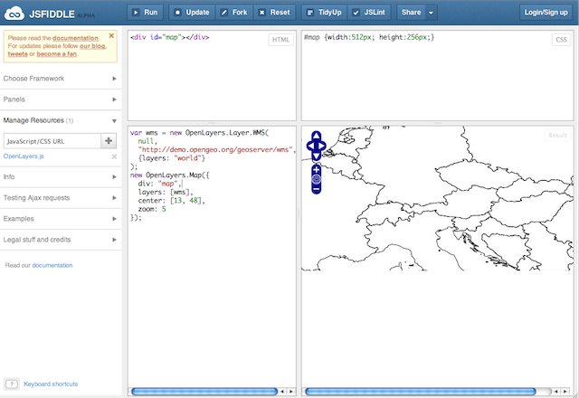

.. _javascript.debugging:

Developing and Debugging JavaScript
===================================

Until a few years ago, debugging JavaScript in web sites was painful: write
code in a text editor, add :command:`alert` statements to inspect values, and
iterate until things work.

The text editor is still the primary tool for JavaScript developers, but these
days with syntax highlighting, code completion and other language specific
tools. Depending on where developers come from, vi, UltraEdit, TextMate or
GEdit are popular choices. There are also plugins for IDEs like Eclipse, or
complete Eclipse distributions made for JavaScript development, like Aptana
Studio.

With JavaScript now being at least equally important as HTML for creating web
sites, all major browsers include a debugger or have one available as a plugin.
For this workshop, we'll be using the WebKit debugger, which is included in
Google Chrome and Safari. For Firefox, the Firebug plugin provides similar
functionality, and Internet Explorer >= 8 has its Developer Tools as well.

Getting Familiar with the Chrome Developer Tools
------------------------------------------------

To launch the Developer Tools in Google Chrome, load the web page you want to
debug (e.g. http://openlayers.org/dev/examples/example.html), and select Tools
> Developer Tools from the wrench menu.

    Chrome Developer Tools at the bottom of a browser window

The Developer Tools can also be detached from the browser window we're
debugging, by clicking the screen icon in the bottom left corner of the
Developer Tools.

The first tab, :guilabel:`Elements`, is useful for inspecting the current state
of the DOM and to see the applied styles from all stylesheet resources. Note
that both the DOM and the styles can be modified in this tab, to see how they
would affect the appearance of the page. Note, however, that these changes
cannot be persisted to the source, so they are only temporary.

The second tab, :guilabel:`Resources`, gives an overview of all resources that
the content of the browser window was created from - including browser
databases, cache and cookies.

The :guilabel:`Network` tab is useful for investigating all traffic between
browser and servers. Every request is listed, and has a detailed view showing
request and response headers, query string parameters, and request and response
data.

The :guilabel:`Scripts` tab is a feature rich JavaScript debugger, which we
will cover in more detail later. It is accompanied by a JavaScript console,
which can either be selected using the "Console" tab, or added to any other
tab by clicking on the :guilabel:`>≡` symbol.

Finally, there are three tabs for performance tuning and profiling
(:guilabel:`Timeline`, :guilabel:`Profiles` and :guilabel:`Audits`), which we
won't be using in this workshop.

Working with the JavaScript Debugger
------------------------------------

Using the Console
~~~~~~~~~~~~~~~~~

The console even makes sense when not debugging, e.g. just for trying out code
snippets. It also supports copying and pasting. Line breaks can be added with
:kbd:`Alt+Return`. Most of the code snippets in the following sections can be
tried out by pasting them into the console.

Selecting Files to Show in the Code Panel
~~~~~~~~~~~~~~~~~~~~~~~~~~~~~~~~~~~~~~~~~

On the top left, there is a dropdown with all JavaScript resources for the
current web page. Let's select OpenLayers.js from this dropdown. We can now
see the contents of the OpenLayers.js file in the main panel of the debugger.
If we scroll down, we see that the script is minified, so the lines are very
long. This is inconvenient when we want to read the code or set breakpoints.
But fortunately we can add meaningful line breaks and indents by clicking the
:guilabel:`{}` icon at the bottom of the code panel.

Stopping JavaScript Execution on Errors
~~~~~~~~~~~~~~~~~~~~~~~~~~~~~~~~~~~~~~~

When running a web application and an error occurs, the Developer Tools list
the number of errors with a red :guilabel:`x` in the bottom right corner. The
console gives an rough explanation of each error. The Developer Tools have two
settings for stopping execution, so the developer can do an inspection of the
application state right before the error occurs. When clicking the Stop/Pause
button in the bottom left of the JavaScript code panel once, execution will be
stopped on any error. When clicking again, it will only stop on unhandled
errors (i.e. those that don't have a try/catch block around them).

Setting Breakpoints
~~~~~~~~~~~~~~~~~~~

In addition to the usual way of setting breakpoints by clicking on a line
number in the code panel, the Chrome Developer tools support breakpoints for
DOM manipulation (to be set in the :guilabel:`Elements` tab, with a right click
on a DOM element), XHR requests (to be set by providing a URL substring) and
browser events. All these kinds of breakpoints can be controlled with the panel
right of the code panel in the :guilabel:`Scripts` tab.

JavaScript breakpoints can be conditional. To set a conditional breakpoint,
right-click on the line number instead of just clicking on it.

Watching Expressions and Navigating the Stack Trace
~~~~~~~~~~~~~~~~~~~~~~~~~~~~~~~~~~~~~~~~~~~~~~~~~~~

Once execution is halted at a breakpoint, the panel on the right of the code
panel allows us to watch expressions and browse the stack trace. When clicking
a function in the stack trace, the code panel will show its code, and the scope
of the console and for watching expressions will be switched to that function.

Console Logging and Programmatic Breakpoints
~~~~~~~~~~~~~~~~~~~~~~~~~~~~~~~~~~~~~~~~~~~~

To log values to the console, use :samp:`console.log()`. There are also other
console statements that are useful for profiling, but :command:`console.log` is
the most important one.

To programmatically add a breakpoint, add the :samp:`debugger` keyword to your
JavaScript code.

Online Tools for Developing JavaScript
--------------------------------------

When asking for help on Open Source project mailing lists, it can be useful to
share code snippets. There are several tools available for this -
http://gist.github.com/ is just one of many. But there are also tools that go
beyond pasting code snippets, allowing to share small example applications.
The most famous one is http://jsfiddle.net/.

    jsFiddle with extra editors for HTML, CSS and JavaScript

For even more web centric development and sharing full web applications on the
web, Cloud9 (http://c9.io/) is a full web based JavaScript IDE.